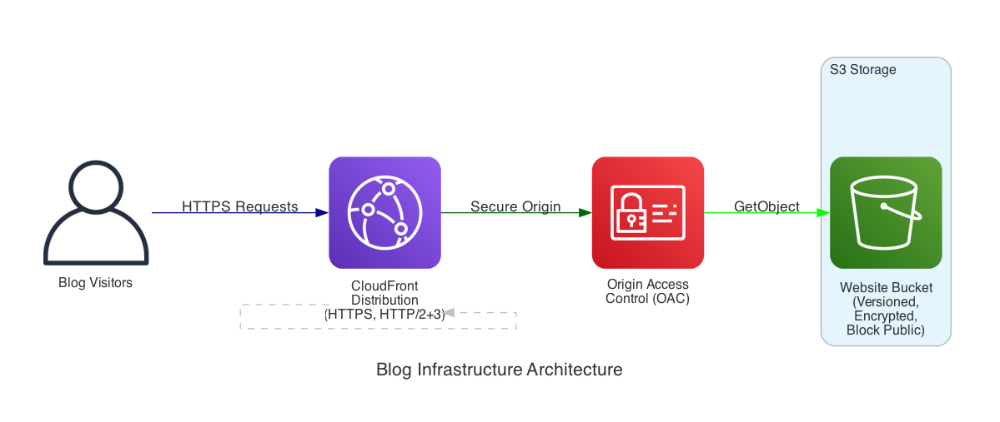

# 靜態部落格系統

一個簡單的 serverless 靜態部落格系統，用於展示儲存在 Git repository 中的 Markdown 文章。使用 AWS S3、CloudFront 和原生 JavaScript 建構。

## 🌐 線上展示

**網站網址**: https://d2cao5u79lg5yr.cloudfront.net

透過 CloudFront CDN 全球加速，提供快速的訪問體驗。

## 功能特色

- 使用 Markdown 和 YAML frontmatter 撰寫文章
- 自動掃描和索引文章
- 透過 CloudFront CDN 快速全球傳輸
- 安全的 HTTPS 存取
- 響應式設計，支援所有裝置
- 程式碼區塊語法高亮
- 簡潔的介面設計
- 即時文章搜尋功能 - 可搜尋標題、內容和標籤
- GitHub Repository 匯入功能 - 自動匯入任何 GitHub repo 的 markdown 檔案

## 架構

```
Git Repository → Build Script → S3 Bucket → CloudFront → 讀者
```

- **S3**: 託管靜態檔案（HTML、CSS、JS、文章）
- **CloudFront**: CDN，提供快速的全球內容傳輸
- **Build Script**: 掃描 markdown 檔案並產生文章索引
- **Frontend**: 使用原生 JavaScript 的 SPA，負責 markdown 渲染

### 架構圖



架構圖會透過 Kiro Agent Hook 自動生成和更新。

**手動產生架構圖：**

```bash
# 安裝 Graphviz（必要）
brew install graphviz  # macOS
# sudo apt-get install graphviz  # Ubuntu/Debian

# 安裝 Python 相依套件
pip install diagrams

# 產生圖表
python3 infrastructure/generate_architecture_diagram.py
```

圖表會儲存為 `generated-diagrams/blog-architecture-updated.png`。

## 快速開始

### 前置需求

- Node.js 18+ 和 npm
- 已設定好的 AWS CLI
- AWS CDK（選用，可使用 npx）

### 1. 安裝相依套件

```bash
npm install
```

### 2. 部署基礎設施

首次設定（如需要，先 bootstrap CDK）：

```bash
npx cdk bootstrap
```

部署基礎設施：

```bash
npm run cdk:deploy
```

這會建立：
- 啟用版本控制的 S3 bucket
- 支援 HTTPS 的 CloudFront distribution
- 適當的安全政策

### 3. 新增文章

在 `articles/` 目錄中建立 markdown 檔案：

```markdown
---
title: "我的第一篇文章"
date: "2024-12-04"
description: "範例部落格文章"
tags: ["教學", "入門"]
---

# 我的第一篇文章

在這裡撰寫你的內容...
```

### 4. 部署內容

建置並部署你的部落格：

```bash
npm run deploy
```

這會執行：
1. 掃描文章並產生索引
2. 建置前端資源
3. 同步到 S3
4. 清除 CloudFront 快取
5. 顯示你的部落格網址

## 專案結構

```
.
├── articles/              # Markdown 文章（你的部落格內容）
│   ├── sample-article.md
│   ├── another-post.md
│   └── comprehensive-markdown-guide.md
├── frontend/              # 前端應用程式（SPA）
│   ├── index.html        # 主要 HTML 模板
│   ├── app.js            # 應用程式邏輯和主控制器
│   ├── router.js         # 客戶端路由（hash-based）
│   ├── search.js         # 搜尋功能
│   ├── github-importer.js # GitHub repository 匯入功能
│   └── styles.css        # 響應式樣式
├── scripts/              # 建置和部署腳本
│   ├── build.js          # 主要建置協調器
│   ├── scanner.js        # 掃描 articles/ 目錄中的 .md 檔案
│   ├── parser.js         # 解析 markdown 的 YAML frontmatter
│   ├── generator.js      # 產生 articles/list.json 索引
│   └── deploy.js         # 部署到 S3 並清除 CloudFront 快取
├── infrastructure/       # AWS CDK 基礎設施程式碼
│   ├── bin/              # CDK app 進入點
│   │   └── blog-infrastructure.js
│   ├── lib/              # CDK stack 定義
│   │   └── blog-infrastructure-stack.js
│   ├── cdk.json          # CDK 設定
│   └── README.md         # 詳細的基礎設施文件
├── tests/                # 測試檔案（單元測試和 property-based 測試）
│   ├── markdown-parser.test.js
│   ├── article-detail.test.js
│   └── error-handling.test.js
├── docs/                 # 額外文件
│   ├── search-and-github-import.md
│   └── ci-cd-setup.md
├── dist/                 # 建置輸出（自動產生，不在 git 中）
│   ├── index.html
│   ├── *.js, *.css
│   └── articles/
│       ├── list.json     # 產生的文章索引
│       └── *.md          # 複製的 markdown 檔案
├── package.json          # Node.js 相依套件和腳本
├── vitest.config.js      # 測試設定
└── README.md             # 本檔案
```

### 主要目錄說明

- **articles/**: 將你的 markdown 檔案放在這裡。建置腳本會自動發現它們。
- **frontend/**: 客戶端應用程式程式碼。修改此處以變更 UI/UX。
- **scripts/**: 建置自動化。修改此處以改變文章處理方式。
- **infrastructure/**: 使用 CDK 定義的 AWS 資源。修改此處以變更基礎設施。
- **tests/**: 自動化測試。新增功能時請加入測試。
- **dist/**: 建置時產生。請勿手動編輯 - 變更會被覆寫。

## 開發

### 本地開發

在本地建置專案：

```bash
npm run build
```

在本地提供服務（需要 http-server 或類似工具）：

```bash
npx http-server dist
```

### 執行測試

```bash
npm test
```

開發時的 watch 模式：

```bash
npm run test:watch
```

## 新功能

### 搜尋功能

使用頁面頂部的搜尋列快速尋找文章：
- 可搜尋標題、內容、標籤或描述
- 即時顯示搜尋結果
- 結果依相關性排序

### GitHub Repository 匯入

從任何公開的 GitHub repository 匯入 markdown 檔案：

1. 點擊標題列的「導入 GitHub Repo」按鈕
2. 輸入 GitHub repository 網址（例如：`https://github.com/marvelshan/tech-forum`）
3. 點擊「讀取文章」以取得所有 markdown 檔案
4. 預覽文章後點擊「確認導入」以匯入

**支援的網址格式：**
- `https://github.com/owner/repo`
- `owner/repo`
- `https://github.com/owner/repo.git`

匯入器會：
- 遞迴掃描所有目錄中的 `.md` 檔案
- 解析 YAML frontmatter 以取得 metadata
- 如果沒有 frontmatter，使用檔案名稱作為標題
- 顯示所有文章並完整渲染 markdown

**可嘗試的範例 repository：**
- `https://github.com/marvelshan/tech-forum`
- 任何包含 markdown 檔案的公開 GitHub repo

詳細文件請參閱 [搜尋和 GitHub 匯入指南](docs/search-and-github-import.md)。

## 撰寫文章

### 如何新增文章

1. **在 `articles/` 目錄中建立 markdown 檔案**：
   ```bash
   touch articles/my-new-article.md
   ```

2. **在檔案開頭加入 frontmatter**（建議）：
   ```yaml
   ---
   title: "我的新文章"
   date: "2024-12-05"
   description: "簡短描述這篇文章的內容"
   tags: ["教學", "javascript"]
   ---
   ```

3. **使用標準 markdown 語法撰寫內容**

4. **建置並部署**：
   ```bash
   npm run deploy
   ```

你的文章會自動出現在部落格中！

### Frontmatter 格式

```yaml
---
title: "文章標題"              # 必填 - 顯示為文章標題
date: "2024-12-04"            # 必填 - ISO 8601 格式（YYYY-MM-DD）
description: "簡短摘要"        # 選填 - 顯示在文章列表中
tags: ["標籤1", "標籤2"]       # 選填 - 用於分類和搜尋
---
```

**重要注意事項：**
- Frontmatter 必須在檔案的最開頭
- 使用有效的 YAML 語法（正確的縮排，特殊字元需加引號）
- 日期格式必須是 `YYYY-MM-DD`
- Tags 應該是字串陣列

### Fallback 行為（無 Frontmatter）

如果你沒有加入 frontmatter，系統會：
- 使用**檔案名稱**（不含 .md）作為標題
- 使用**檔案修改時間**作為日期
- 描述和標籤留空

範例：`my-article.md` → 標題：「my-article」

### Markdown 支援

我們的部落格支援所有標準 markdown 功能：

**文字格式：**
- **粗體** 使用 `**文字**` 或 `__文字__`
- *斜體* 使用 `*文字*` 或 `_文字_`
- ~~刪除線~~ 使用 `~~文字~~`

**標題：**
```markdown
# H1 標題
## H2 標題
### H3 標題
```

**清單：**
```markdown
- 無序項目
- 另一個項目
  - 巢狀項目

1. 有序項目
2. 另一個項目
```

**程式碼：**
- 行內：`` `code` ``
- 區塊：使用三個反引號並指定語言以啟用語法高亮

````markdown
```javascript
function hello() {
  console.log("Hello, world!");
}
```
````

**連結和圖片：**
```markdown
[連結文字](https://example.com)

```

**表格：**
```markdown
| 標題 1 | 標題 2 |
|--------|--------|
| 儲存格 1 | 儲存格 2 |
```

**引用：**
```markdown
> 這是一段引用
```

完整範例請參閱 `articles/comprehensive-markdown-guide.md`。

### 檔案命名最佳實踐

- **使用 `.md` 副檔名** - 自動發現所需
- **使用 kebab-case** - `my-article-title.md`（小寫加連字號）
- **避免空格** - 使用連字號代替：`my article.md` ❌ → `my-article.md` ✅
- **使用描述性名稱** - 檔案名稱會成為 URL slug：`getting-started-guide.md`
- **避免特殊字元** - 只使用字母、數字和連字號

### 組織文章

所有文章都放在 `articles/` 目錄中。系統會：
- 自動掃描所有 `.md` 檔案
- 忽略隱藏檔案（以 `.` 開頭）
- 依日期排序（最新的在前）
- 在建置時產生索引

如有需要，你可以使用子目錄組織，掃描器會遞迴尋找它們。

### 在本地測試文章

1. 將文章加入 `articles/`
2. 建置專案：`npm run build`
3. 在本地提供服務：`npx http-server dist`
4. 在瀏覽器開啟 `http://localhost:8080`
5. 驗證格式、連結和圖片是否正常運作

### 常見問題

**文章沒有出現？**
- 檢查 frontmatter YAML 語法（使用 YAML 驗證器）
- 確保檔案有 `.md` 副檔名
- 重新建置：`npm run build`

**日期格式錯誤？**
- 使用 ISO 8601：`YYYY-MM-DD`（例如：`2024-12-05`）
- 不要使用 `12/05/2024` 或其他格式

**程式碼沒有高亮？**
- 在開頭反引號後指定語言：` ```javascript `
- 支援的語言：javascript、python、typescript、bash、json、html、css 等

**圖片無法載入？**
- 外部圖片使用絕對網址
- 本地圖片放在 `frontend/` 並使用相對路徑參照
- 新增圖片後重新建置並部署

## 部署

### 自動化 CI/CD（GitHub Actions）

專案包含 GitHub Actions workflow，會在每次推送到 main branch 時自動建置和部署。

#### 設定 GitHub Actions

1. **設定 AWS 憑證**

   workflow 使用 OIDC 進行安全的 AWS 認證。在你的 AWS 帳戶中設定以下內容：

   ```bash
   # 為 GitHub Actions 建立 OIDC provider（一次性設定）
   aws iam create-open-id-connect-provider \
     --url https://token.actions.githubusercontent.com \
     --client-id-list sts.amazonaws.com \
     --thumbprint-list 6938fd4d98bab03faadb97b34396831e3780aea1
   ```

   使用以下 trust policy 建立 IAM role：

   ```json
   {
     "Version": "2012-10-17",
     "Statement": [
       {
         "Effect": "Allow",
         "Principal": {
           "Federated": "arn:aws:iam::ACCOUNT_ID:oidc-provider/token.actions.githubusercontent.com"
         },
         "Action": "sts:AssumeRoleWithWebIdentity",
         "Condition": {
           "StringEquals": {
             "token.actions.githubusercontent.com:aud": "sts.amazonaws.com"
           },
           "StringLike": {
             "token.actions.githubusercontent.com:sub": "repo:YOUR_GITHUB_USERNAME/YOUR_REPO_NAME:*"
           }
         }
       }
     ]
   }
   ```

   將 S3 和 CloudFront 存取政策附加到該 role。

2. **設定 GitHub Secrets**

   在你的 GitHub repository 中新增以下 secrets（Settings → Secrets and variables → Actions）：

   - `AWS_ROLE_ARN`: 上面建立的 IAM role ARN（例如：`arn:aws:iam::123456789012:role/GitHubActionsRole`）
   - `AWS_REGION`: AWS 區域（例如：`us-east-1`）
   - `S3_BUCKET_NAME`: 你的 S3 bucket 名稱
   - `CLOUDFRONT_DISTRIBUTION_ID`: 你的 CloudFront distribution ID

3. **Workflow 觸發條件**

   workflow 會在以下情況執行：
   - 推送到 `main` branch（建置、測試和部署）
   - Pull requests（僅建置和測試）
   - 透過 GitHub Actions UI 手動觸發

#### Workflow 步驟

1. **Checkout code** - 取得 repository
2. **Setup Node.js** - 安裝 Node.js 20 並啟用 npm 快取
3. **Install dependencies** - 執行 `npm ci` 進行乾淨安裝
4. **Run tests** - 執行所有測試
5. **Build** - 產生文章列表並打包前端
6. **Configure AWS credentials** - 使用 OIDC 進行 AWS 認證
7. **Deploy to S3** - 將建置輸出同步到 S3 bucket
8. **Invalidate CloudFront cache** - 清除 CDN 快取以立即更新

### 手動部署

#### 基礎設施更新

部署前檢視變更：

```bash
npm run cdk:diff
```

部署基礎設施變更：

```bash
npm run cdk:deploy
```

#### 內容更新

新增或修改文章後：

```bash
npm run deploy
```

#### 手動 S3 同步

如有需要，手動同步檔案：

```bash
aws s3 sync dist/ s3://YOUR-BUCKET-NAME/ --delete
```

#### 快取清除

手動清除 CloudFront 快取：

```bash
aws cloudfront create-invalidation \
  --distribution-id YOUR-DIST-ID \
  --paths "/*"
```

## 設定

### 快取設定

- 靜態資源（JS、CSS、圖片）：1 年
- HTML 和 JSON：5 分鐘
- CloudFront 處理壓縮（Gzip/Brotli）

### 安全性

- S3 bucket 封鎖所有公開存取
- 內容僅透過 CloudFront 提供
- 強制 HTTPS（HTTP 重新導向到 HTTPS）
- Origin Access Control 確保 S3 安全存取
- 啟用版本控制以支援回滾

## 成本最佳化

- CloudFront 快取減少 S3 請求
- 免費方案涵蓋大多數小型部落格
- 僅需支付儲存和資料傳輸費用
- 無需維護伺服器

## 疑難排解

### 建置失敗

檢查是否已安裝所有相依套件：
```bash
npm install
```

### 部署失敗

確保已先部署基礎設施：
```bash
npm run cdk:deploy
```

驗證 AWS 憑證：
```bash
aws sts get-caller-identity
```

### 文章未顯示

- 檢查 frontmatter 格式（有效的 YAML）
- 確保檔案在 `articles/` 目錄中
- 重新建置並部署：`npm run deploy`
- 檢查 CloudFront 快取清除是否完成

### 404 錯誤

- 等待 CloudFront 快取清除完成（5-10 分鐘）
- 檢查 S3 bucket 是否有檔案
- 驗證 CloudFront distribution 是否已啟用

## 腳本參考

- `npm run build` - 在本地建置專案
- `npm run deploy` - 部署內容到 AWS
- `npm test` - 執行測試
- `npm run test:watch` - 以 watch 模式執行測試
- `npm run cdk:deploy` - 部署基礎設施
- `npm run cdk:diff` - 檢視基礎設施變更
- `npm run cdk:synth` - 產生 CloudFormation 模板
- `npm run cdk:destroy` - 銷毀基礎設施（⚠️ 會刪除所有內容）

## 基礎設施詳情

詳細的基礎設施文件請參閱 [infrastructure/README.md](infrastructure/README.md)。

## 授權

MIT

## 貢獻

1. Fork repository
2. 建立 feature branch
3. 進行變更
4. 執行測試：`npm test`
5. 提交 pull request

## 支援

如有問題：
- 查看疑難排解章節
- 檢閱基礎設施文件
- 查看 AWS CloudWatch logs
- 在 GitHub 開啟 issue
